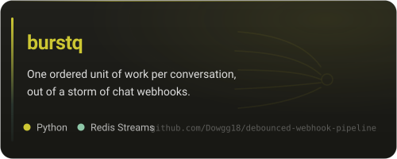
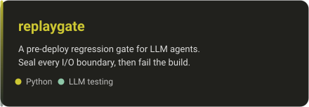
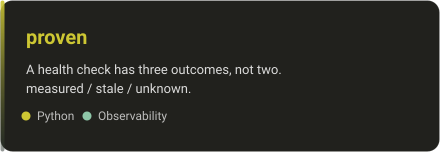

 

I run a multi-tenant SaaS in production — FastAPI, Redis, Postgres and Next.js on
Docker Swarm — with paying customers and nobody else on call.

The repositories below are problems that system surfaced, pulled out and solved
the way I wish I had found them. None of them are demos.

 

 

### The problem behind each one

**[burstq](https://github.com/Dowgg18/debounced-webhook-pipeline)** — people type
the way they talk, so one question arrives as four webhook deliveries in three
seconds, and the provider redelivers half of them. Built around three failure
modes that pass every test you would think to write: an idempotency key that
silently eats your retries, a debounce window that dies with the process that
opened it, and a per-conversation lock that stops locking the moment you run two
replicas.

**[replaygate](https://github.com/Dowgg18/agent-replay-gate)** — substring
assertions break on rewording, live-model tests cost money and never repeat, and
"it looked fine in the console" is not a gate. So: replay conversations through
the real code with every I/O boundary sealed under a policy — fake it, count it,
or forbid it — and fail the build the moment a deterministic path reaches for the
model.

**[proven](https://github.com/Dowgg18/unhealthy-until-proven)** — a health check
has three outcomes, not two. A dashboard I owned reported a channel as
**Connected** for two months after it had died, because the status column was
only ever written on the happy path, so it climbed to green and could never come
back down.

 

### Stack

 

 

### Currently

**Kamo** — a multi-tenant SaaS where an AI agent handles customer conversations
end to end for vehicle dealerships: qualifying, collecting financing details, and
handing over to a salesperson at the right moment. Roughly 28k messages and 1.5k
leads through it so far.

I write against the model SDK directly rather than through an abstraction
framework, and I keep the interesting failures instead of hiding them — the three
repositories above exist because of that.

 

<picture>
  <source media="(prefers-color-scheme: dark)" srcset="https://raw.githubusercontent.com/Dowgg18/Dowgg18/output/chameleon-dark.svg" />
  <source media="(prefers-color-scheme: light)" srcset="https://raw.githubusercontent.com/Dowgg18/Dowgg18/output/chameleon.svg" />
  
</picture>

It takes the colour of whatever it just ate — <a href="scripts/chameleon.py">scripts/chameleon.py</a>, no dependencies.

  

